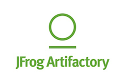
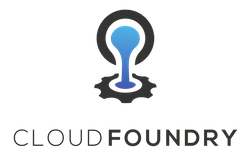

# JavaScript CI/CD Demo

### Why implement CI/CD?

Continuous integration (CI) and continuious delivery (CD) enable sustainable software and fast, reliable deployments. CI starts with automated builds and tests, typically unit tests. This is however just the first step. Testing independent units and monoliths is relatively straightforward. 

To text complex systems, we'll also leverage continuous delivery, which helps _make sure the code is always deployable_. This lets us test the components both individually and as a whole.

### Automated Workflow

Such a CI/CD Workflow can have many steps, for example:

- Lint Code
- Run Unit Tests
- Create Build / Compile Code
- Run Code Coverage Analysis
- Archive Build
- Autogenerate Documentation
- Deploy to Dev/Stage/Prod
- Run E2E Tests with a Browser
- Promote Artifact

We'll cover many of these steps in our, which consists of two components:

- [AngularJS Frontend](https://github.com/AllianzDeutschlandAG/cidemo-frontend)
- [Express Backend](https://github.com/AllianzDeutschlandAG/cidemo-backend)

## Stack Setup

#### 1. Install PCF Dev

Download and [install pcf dev](https://docs.pivotal.io/pcf-dev/index.html) separately from Pivotal (requires registration and [virtualbox](https://www.virtualbox.org/)). Once installed, start your PaaS:

```
pcf dev start
```

Note: Cloud Foundry make require up to 10 minutes to start.

####  2. Clone this Repository

```
git clone https://github.com/AllianzDeutschlandAG/cidemo.git
```

####  3. Initialize Submodules

The Angular frontend Node backend are included as submodules. You will have to fast-forward those repositories so:

```
git submodule update --init
```
 
#### 4. Configure Environment

For our components to communicate with each other properly we set our local IP address to `LOCAL_IP` environment variable. In terminal, run:

```
. ./env
```

#### 5. Start Stack

To build all container images and start in one step, run:

```
docker-compose up --build
```

## AZD Cloud Stack

Once the stack is up and running you can explore around:

| Tool                   | URL                                                                      | Username | Password   |
|:-----------------------|:-------------------------------------------------------------------------|:---------|:-----------|
| Jenkins                | [http://localhost:8080/](http://localhost:8080/)                         | `cidemo` | `cidemo`   |
| Artifactory            | [http://localhost:8000/](http://localhost:8000/)                         | `admin`  | `password` |
| Cloud Foundry          | [https://apps.local.pcfdev.io/](https://apps.local.pcfdev.io/)           | `user`   | `pass`     |
| Selenium Hub           | [http://localhost:4444/grid/console](http://localhost:4444/grid/console) | -        | -          |
| Angular App (Frontend) | [http://localhost/](http://localhost/)                                   | -        | -          | 
| Node App (Backend)     | [http://localhost:3000/](http://localhost:3000/)                         | -        | -          |

### Enterprise means do-it-yourself (DIY)

There are great industry tools like [Travis CI](https://travis-ci.org/), [Codeship](https://codeship.com/) and [CircleCI](https://circleci.com/), which help companies hit the ground running with continuous integration and delivery. However, as an insurer and financial institution, we cannot use tools due to laws regarding auditing and privacy. So we keep our entire CI/CD workflows in house in our own cloud stack.

For this demo, we will focus on one slice of the stack which leverages PaaS for fast one line deploys, e.g. `cf push`. Much of the stack uses open source software and is included in the [`docker-compose.yml`](./docker-compose.yml) file.

- ### Jenkins
  _(Open source and free)_  
  
  
  Our automation server, which controls the workflows aka pipelines.

  ---

- ### Selenium Hub
  _(Open source and free)_  
  
  
  

  Provides Chrome and Firefox browsers for end-to-end testing. Local browser testing results in the "works on my machine" problem. Additionally having a hub means you can simultaneously test many browser versions.

  To make more than one browser available, scale up using Docker like so:

  ```
  docker-compose scale chrome=3
  ```

  ---

- ### Artifactory
  
  

  Artifactory is a repository manager used for:

  - archive builds artifacts including source code for auditing purposes 
  - cache other repositories, e.g. npmjs.com
  - host private libraries

  A repository manager is crucial not just for auditing, but also for complex continuous delivery workflows. If a build passes the dev stage, you don't want to build it again. So at the next stage you will be grabbing it from Artifactory.

  For this demo, we will be using the [Artifactory OSS](https://www.jfrog.com/open-source/) open sourced version with limited functionality - but free.

  ---

- ### Pivotal Cloud Foundry

  

  The cloud application platform where we will deploy our applications. For the demo, we will be running a local copy of [PCF Dev](https://pivotal.io/pcf-dev). Unlike the rest of the toolchain, you need to [install pcf dev separately](https://docs.pivotal.io/pcf-dev/index.html).

  Once installed login at [https://apps.local.pcfdev.io/](https://apps.local.pcfdev.io/)
